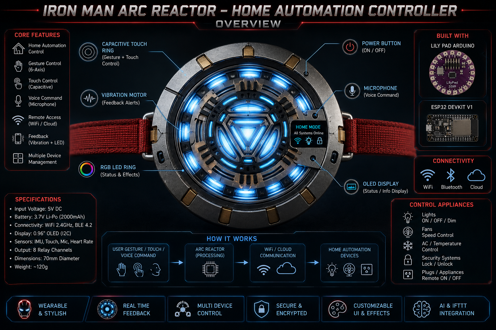

# ⚡ Iron Man Arc Reactor Home Automation System

<div align="center">



# Futuristic Wearable IoT Automation System

### Developed using ESP32 + Arduino LilyPad


</div>

---

# 📌 Overview

The **Iron Man Arc Reactor Home Automation System** is a futuristic wearable smart automation controller inspired by Tony Stark’s Arc Reactor.

This project combines:

- Wearable Computing
- IoT Automation
- RGB Reactor Effects
- Gesture Recognition
- Wireless Smart Home Control
- OLED Display Interface
- Haptic Feedback
- MQTT Communication

The system allows users to control home appliances remotely through:

- Gestures
- Touch input
- Mobile application
- Wi-Fi communication
- MQTT cloud automation

---

# 🚀 Features

## ⚡ Arc Reactor RGB Effects

- Circular glowing reactor core
- AI breathing effect
- Power pulse animation
- Combat alert mode
- Reactor charging effect

---

## 🌐 Home Automation

Control:

- Lights
- Fans
- Smart switches
- RGB room lights
- IoT appliances

Using:

- ESP32 Wi-Fi
- MQTT broker
- Mobile dashboard

---

## 🤖 Gesture Recognition

Using MPU6050 sensor:

| Gesture     | Action             |
| ----------- | ------------------ |
| Raise Hand  | Light ON           |
| Swipe Right | Fan ON             |
| Swipe Left  | Fan OFF            |
| Double Tap  | Reactor Boost Mode |

---

## 📲 Mobile Dashboard

Features:

- Device control
- RGB color control
- Reactor brightness
- Live system monitoring
- Automation modes

---

# 🧠 Technologies Used

| Technology      | Purpose                 |
| --------------- | ----------------------- |
| ESP32           | IoT Communication       |
| Arduino LilyPad | Wearable Controller     |
| MQTT            | Real-time Communication |
| NeoPixel LEDs   | Arc Reactor Effects     |
| MPU6050         | Gesture Recognition     |
| OLED Display    | System Monitoring       |
| Relay Module    | Appliance Switching     |

---

# 🛠 Hardware Components

| Component               | Quantity |
| ----------------------- | -------- |
| ESP32 DevKit V1         | 1        |
| Arduino LilyPad         | 1        |
| WS2812B NeoPixel Ring   | 1        |
| MPU6050 Sensor          | 1        |
| OLED Display            | 1        |
| Capacitive Touch Sensor | 1        |
| Relay Module            | 1        |
| Li-Po Battery           | 1        |
| TP4056 Charger Module   | 1        |

---

# 🔌 Pin Connections

# ESP32 Connections

| ESP32 Pin | Component     |
| --------- | ------------- |
| GPIO 23   | Relay IN1     |
| GPIO 22   | Relay IN2     |
| GPIO 21   | Relay IN3     |
| GPIO 19   | Relay IN4     |
| GPIO 18   | NeoPixel Data |
| GPIO 4    | Touch Sensor  |
| GPIO 21   | OLED SDA      |
| GPIO 22   | OLED SCL      |

---

# LilyPad Connections

| LilyPad Pin | Component       |
| ----------- | --------------- |
| A0          | MPU6050 SDA     |
| A1          | MPU6050 SCL     |
| D5          | NeoPixel LEDs   |
| D6          | Vibration Motor |

---

# 📂 Project Structure

```text
IronMan_Arc_Reactor/
│
├── firmware/
│   ├── esp32_controller/
│   ├── lilypad_controller/
│   └── shared/
│
├── mobile_app/
│
├── hardware/
│
├── docs/
│
└── README.md
```

---

# 📦 Required Libraries

Install these Arduino libraries:

```bash
WiFi.h
PubSubClient
Adafruit NeoPixel
Adafruit SSD1306
Adafruit GFX
MPU6050
FastLED
Wire
```

---

# ⚙️ Installation Guide

## 1️⃣ Clone Repository

```bash
git clone https://github.com/ShivamMathtech/iron-man-reactor-home-automation-system.git
```

---

## 2️⃣ Open Firmware

Open:

```text
firmware/esp32_controller/esp32_controller.ino
```

and

```text
firmware/lilypad_controller/lilypad_controller.ino
```

inside Arduino IDE.

---

## 3️⃣ Install Libraries

Go to:

```text
Arduino IDE → Library Manager
```

Install all required libraries.

---

## 4️⃣ Configure Wi-Fi

Edit:

```cpp
secrets.h
```

```cpp
#define WIFI_SSID "YOUR_WIFI"
#define WIFI_PASSWORD "YOUR_PASSWORD"
```

---

## 5️⃣ Upload Code

- Upload ESP32 firmware
- Upload LilyPad firmware

---

# 🌐 MQTT Topics

| Topic               | Function           |
| ------------------- | ------------------ |
| arc/reactor/control | Appliance Commands |
| arc/reactor/status  | System Status      |
| arc/reactor/mode    | Reactor Modes      |

---

# 💡 Reactor Modes

| Mode        | Description               |
| ----------- | ------------------------- |
| Idle Mode   | Soft Blue Glow            |
| AI Mode     | Cyan Breathing Effect     |
| Power Mode  | Rotating Energy Animation |
| Combat Mode | Red Alert Flash           |

---

# 🔋 Power System

The project uses:

- 3.7V Li-Po Battery
- TP4056 Charging Module
- 5V Boost Converter

This allows the reactor to be fully wearable and rechargeable.

---

# 🔒 Security Features

- MQTT secure communication
- Password-protected dashboard
- Emergency shutdown mode
- Battery protection circuit

---

# 📷 Project Images

## Circuit Diagram

```text
hardware/circuit_diagram.png
```

## Reactor Overview

```text
hardware/reactor_design.png
```

---

# 🚀 Future Upgrades

- ESP32-CAM Integration
- Face Recognition
- AI Voice Assistant
- ChatGPT Integration
- Alexa Support
- Firebase Integration
- OTA Firmware Updates
- AI Gesture Learning

---

# 🧠 Applications

- Smart Home Automation
- Wearable Electronics
- IoT Research
- Futuristic UI Systems
- Embedded AI Projects
- Robotics Interaction

---

# 👨‍💻 Developed By

# Shivam Singh

### Founder of MathTech

GitHub Repository:

https://github.com/ShivamMathtech/iron-man-reactor-home-automation-system.git

---

# ⭐ Support

If you like this project:

- Star the repository
- Fork the project
- Share with the IoT community

---

# 📜 License

This project is licensed under the MIT License.

---

# ⚡ “Sometimes you gotta run before you can walk.”

### — Tony Stark
